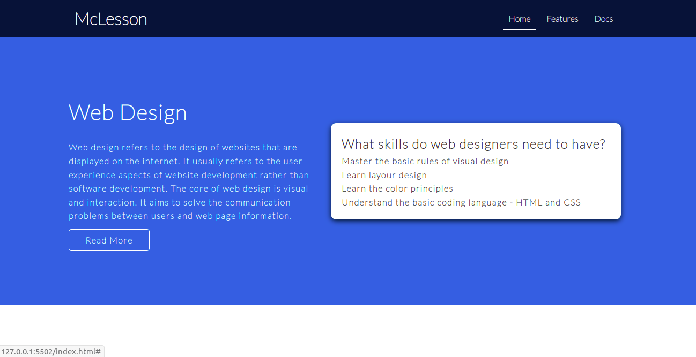

# McLesson

## Problem Statement

Create a web page which has a navbar and herounit using display properties like flex and grid. The web page should resemble the image as shown below.

## Tasks
- To build the solution for this practice, define styles in style.css located in the css folder.​
- Use CSS3 flex and grid layouts for styling page components.
- Following tasks need to be completed to build the solution for this practice:​​
    - Task 1 :: Create Header​
    - Task 2 :: Create Hero Unit​

### Task 1
- The header should contain ​
    - brand name aligned to the left of the header​
    - navbar with navigation links aligned to the right of the header​
- The layout for the header should be styled using CSS3 Flex property​
- Use the Google Font “Lato” for styling fonts using the stylesheet​
    `https://fonts.googleapis.com/css2?family=Lato:ital,wght@0,100;1,300&display=swap`​
- All navigation link text should not be decorated with underline​
- The navigation links can be listed using an unordered list with list items appearing adjacent to each other.​

### Task 2
- The layout for the hero unit section should be styled using CSS3 Grid property.​
- The grid contains two columns with first column occupying 45% of total width and second column occupying 55% of total width available.​
-  The gap between the columns should be of 20px​.
- The contents of the columns should be aligned in the center, horizontally as well as vertically.​
- The first column content can be presented as text.​
- The second column content can be presented as a card. Use box-shadow property to make it view like a card.​

### Details

- Color codes used in this web page are:
    - #047ade (Herounit)
    - #fff
    - #333 (Text inside card)
    - #011a37 (Navbar)
    - Black (box-shadow)
- Font family used is:
    - Lato, san-serif

